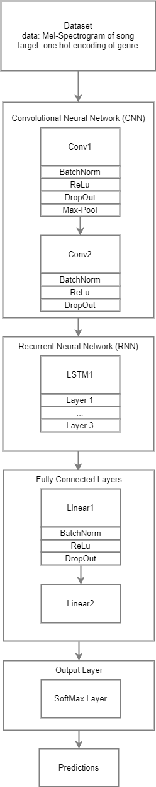

# Music-Recognition | RNN Model

Music has been historically categorized by humans into several genres, such as rock, blues, classical, and hip-hop.

Our model located in `model.py` analyzes segments of digital music recordings to predict the mood, and theme <!-- Add more? --> of the sample. The model will rely on pattern recognition based on the sequence of features extracted from different time sequences of the musical input.

## Data

We will be using the [MTG-Jamendo dataset](https://zenodo.org/record/3826813) which is a relatively new music dataset created in 2019 and contains more than 55,000 tracks with 195 tags. All of the tracks in the dataset can be found on Freesound.org, a creative-commons licensed music library. Custom subsets of the data set are available on the [MGT github](https://github.com/MTG/mtg-jamendo-dataset/tree/master/data).

The 195 tags in the MTG-Jamendo dataset consist of 95 genres, 41 instruments, and 59 mood/themes. The 5 most popular mood/themes are happy, melodic, dark, relaxing, and energetic. All tags in the dataset are guaranteed to have at least 100 tracks assigned to each.

The pre-processing of the dataset is found in `preprocess.py`, it aligns the song's melspectrogram with its repective mood/theme represented as a one-hot encoding.

## Model

<!-- Get draw.io diagram here: https://drive.google.com/file/d/1bzp8DmXyVA3tZMGHvwD5Hm7ej_323Axe/view?usp=sharing -->

    

<!-- Count the number of parameters in the model, and a description of where the parameters come from

Examples of how the model performs on two actual examples from the test set: one successful and one
unsuccessful 

TODO: ? utilize various attention-based mechanisms to optimize the performance and predictive accuracy.  -->

## Training

## Results

## Ethical Consideration
All the music in the MTG-Jamendo dataset is available under a Creative Commons Attribution Non-Commercial Share Alike license.

We see our model as helpful, as it can be used by other audio/music hosting applications when attempting to sort their data by categorizing their music libraries. Moreover, it could highlight similarities between genres, and may uncover certain patterns between them, which could augment research in the musical space.

## Authors 
- Tomasz Cieslak
- Mina Makar
- Daren Liang
- George Lewis

Data subset breakdown
https://github.com/MTG/mtg-jamendo-dataset/tree/master/data