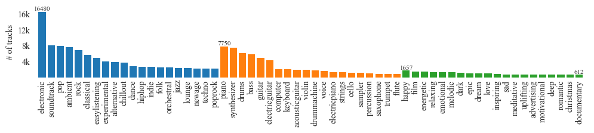

# Music-Recognition | RNN Model

Music has been historically categorized by humans into several genres, such as rock, blues, classical, and hip-hop.

Our model located in `model.py` is an CNN-RNN model that analyzes segments of digital music recordings to predict the genre of the sample. The model will rely on pattern recognition based on the sequence of features extracted from different time sequences of the musical input.

## Data Source

We will be using the [MTG-Jamendo dataset](https://zenodo.org/record/3826813) which is a relatively new music dataset created in 2019 and contains more than 55,000 tracks with 195 tags. All of the tracks in the dataset can be found on Freesound.org, a creative-commons licensed music library. Custom subsets of the data set are available on the [MGT github](https://github.com/MTG/mtg-jamendo-dataset/tree/master/data).

<p align="center">
    
</p>

The 195 tags in the MTG-Jamendo dataset consist of 95 genres, 41 instruments, and 59 mood/themes. The 5 most popular mood/themes are happy, melodic, dark, relaxing, and energetic. All tags in the dataset are guaranteed to have at least 100 tracks assigned to each.

Metadata of the songs are stored in a .tsv file with track ID, artist ID, album ID, path, duration, and tags, while each of the pre-processed songs are stored in the dataset dump (corresponding to the path in the metadata) as NPY files (NumPy Arrays) consisting of mel-spectrogram values.

### Obtaining and Processing the Data

> :warning: You should have at least 300GB of free disk space to download and process the data.

Clone the MTG-Jamendo dataset repo and setup an virtual environment

```bash
git clone https://github.com/MTG/mtg-jamendo-dataset
cd mtg-jamendo-dataset
python -m venv venv
source venv/bin/activate
pip install -r scripts/requirements.txt
```

Download the melspectrogram files

```bash
python scripts/download/download.py dump-spec/ --type melspecs
```

Copy the `trim_30s.py` file into the mtg-jamendo-dataset repo and run the script to trim melspectrogram files to 30s

```bash
python trim_30s.py
```

### Data Transformation

The data loading code is located in `preprocess.py`. For simplicity in training, we've opted to filter out all entries that involed multiple tags. This reduced our dataset from ~55k to ~9k. Since some tags may contain more songs than others, we've also selected the same number of songs from each tag we want to classify to make sure the dataset is balanced. The final dataset size is ~3k entries.

Here is an example of loading a dataset of songs tagged by genre.

```py
from preprocess import MusicDataset

dataset = MusicDataset("./autotagging_genre.tsv", "dump-spec-trimmed/")
```

Each dataset element is a tuple containing the audio sample and the one hot vector containing tags:

```py
sample, one_hot = dataset[0]
assert sample.shape == (96, 1400)
assert one_hot.tolist() == [0, 0, 1, ..., 0]
```

The `MusicDataset` class implements PyTorch's dataset API so it can be used in PyTorch's dataloader:

```py
from torch.utils.data import DataLoader

dataloader = DataLoader(dataset, batch_size=256, shuffle=True)
```

### Data Split

We randomly split the data into test, validation, and training sets. The training set is 80% of the data, then we evenly split the remaining 20% between the validation and test sets. The dataset used is fairly large, hence it is acceptable to use a smaller validation and test set ratio in respect to the training set. We also look to ensure that the entire set includes equal amount of data that is split evenly between all the classes, this prevents the model from training and overfitting on a specific class which might have more data points.

## Training - Model

Our model starts with two convolutional layers on the input sequence, followed by a recurrent LSTM layer, and then finally a dense layer to produce our prediction.

<p align="center">
    
</p>


## Model Parameters

`hidden_channel=16`

`linear_transform=32`

`output_channel=8`

Hidden channel, the number of features extracted at each layer in our RNN, was chosen to be 16, as there are 96 input channels associated with each spectrogram signal, if set too high, runtime would be affected, and if set too low, some information loss would occur given the high number of input channels. For similar reasons, linear transform, the dimension of the hidden dense layer, was set to 32, as to avoid information loss. 

We start with 8 output channels in the first CNN layer, and then double it in the following layer, as we attempt to capture more features along the learning process. Starting off with more than 8 output channels would be too memory intensive for our model, and time consuming for our training of the model. 

## Model examples

`Successful - track_0001260	artist_000209	album_000196	60/1260.mp3	129.0	genre---pop`

`Unsuccessful - track_0003444	artist_000014	album_000545	44/3444.mp3	151.8	genre---metal`

The model had insufficient data to train on, and was overfit to a small training dataset, and could not reach a signficant accuracy for validation accuracy. Moreover, the dataset was not comprehensive to include varying patterns and melodies in music to allow the model to learn to differentiate between 11 different genres.

## Training Curve

<p align="center">
    
</p>

<p align="center">
    
</p>

We notice a plateau in validation loss and accuracy and believe the model is overfitting.

## Hyperparamter Tuning 

Following hyperparameters were set to the following values: 

num_layers=3,
learning_rate=0.01,
weight_decay=0.001,
dropout=0.5,
kernel_size=3,
pool_size=2

Number of layers in the RNN was set to 3, as the input data is complex and requires a deep network to capture all the relevant information.

Learning rate and weight decay were chosen to be relatively small, given our use of a large dataset, small learning rate and weight decays prevent overfitting to the training data, and allow the model to adjust the optimal weights at each layer gradually to converge to a global optimum.

Dropout layer is set to 0.5 to randomly half the data samples in order to minimize reliance on outliers, and any given subset of the data.

Kernel size and pool size were set their respective values, as they are the recommended values to use for most CNN layers.

## Quantitative Measures

Using recall formula for accuracy (true positives / (true positives + false negatives)) ?
Binary cross entropy for loss function ?

## Quantitative and Qualitative Results

A full model training and accuracy against validation and test day is shown below, including how our dataset was split and distributed.

```py
Loaded 3608 data points
Number of music samples in the training set:  2886
Number of music samples in the val set:  361
Number of music samples in the test set:  361
Epoch 0. Iteration 5. [Val Acc 11.0803%] [Train Acc 9.1130%, Loss 0.004877]
...
Epoch 990. Iteration 4955. [Val Acc 24.0997%] [Train Acc 57.0686%, Loss 0.003984]
RNN model provided a test accuracy of:  0.24376731301939059
```

Our model results in a Test and Validation accuracy of 24% (sometimes 30%) where as the Training accuracy fluctuated between 57-90% accuracy depending on how overfit the model is trained.

## Results and Summary

We hypothesize that the method we have implemented to train and validate our model is somewhat functional, but it lacks stability with both our dataset and architecture. In an effort to address this, we made various adjustments to our model, such as reducing or increasing some layers and modifying their complexity. After experimentation with hyperparameters, we determined that the ones we used were the most realistic for our music recognition problem.

One challenge we faced was determining a stable and compatible loss and accuracy function, given that our dataset requires classifications for 59 mood/themes, made it difficult to calculate accuracy using the standard correct÷total formula. To mitigate this, we employed the `BCEWithLogitsLoss` function with a `pos_weight` initialized to the average number of (negative predictions) ÷ (positive predictions) to give more weight to correctly identifying the positive mood/themes. Additionally, we used the recall accuracy formula to detect only positive samples, ignoring any negative samples misclassified as positive. Although our attempts improved our results, we continued to experience instability and concluded that this approach was not suitable for our label classification problem.

We hypothesized that our problem was too challenging, as we were asking our RNN to predict a large multi-label output based on a given piece of music. To address this, we considered creating a separate binary classification model for each label and then ensembling the results to produce the final multi-label prediction. Each sub-model would be an identical RNN, but with different weights. We believed that this new architecture could achieve a higher validation accuracy because each sub-model had an easier problem to solve. However, we recognized that this approach may have come with an independence assumption, given that the labels for a sample may be related. Ultimately, we decided not to pursue this approach and instead simplified our model in a different way.

We ultimately decided to switch to multi-classification rather than multi-label classification, given the instability we were experiencing with accuracy and loss. We also concluded that using a data subset with genre tags for music classification was more discernible, particularly when filtering songs that only identified with a single genre. When we trained the model with this new problem, we observed reasonable results and much-improved stability. However, even after training the model over hundreds of epochs and adjusting our hyperparameters, we noticed that our model appeared to be overfitting to our training data. We believe that this may be due to the limited number of entries in our training set and the possibility that our dataset may not be well-suited to our model's architecture.

## Ethical Consideration

All the music in the MTG-Jamendo dataset is available under a Creative Commons Attribution Non-Commercial Share Alike license.

We see our model as helpful, as it can be used by other audio/music hosting applications when attempting to sort their data by categorizing their music libraries. Moreover, it could highlight similarities between genres, and may uncover certain patterns between them, which could augment research in the musical space.

There are several limitations of our model.
1. Can only make predictions on 30s audio samples, meaning that we can't effectively classify longer pieces of music, without first dividing it into sections, furthermore if there is a sample shorter than 30s, then it has to be padded for a prediction to be made, and it will likely not be very high quality. Shorter music samples may arise in certain commercial applications like the advertising industry, or video game development, where this model could be of use.
2. Model is trained on data that is "subjectively" labelled, and not everyone may agree on some of the labels.

## Authors 
- Tomasz Cieslak: Ran model training locally. Worked on model implementation, training and architecture. Contributed to final readme. 

- Mina Makar:  Researched model and different methods to train the model, Aided in model implementation, and contributed to the final readme

- Daren Liang: Downloaded and preprocessed the data to use PyTorch's dataset API. Also helped with model implementation and final readme.

- George Lewis: Worked on model implementation and provided input on architecture decisions. Contrubted to the readme.

